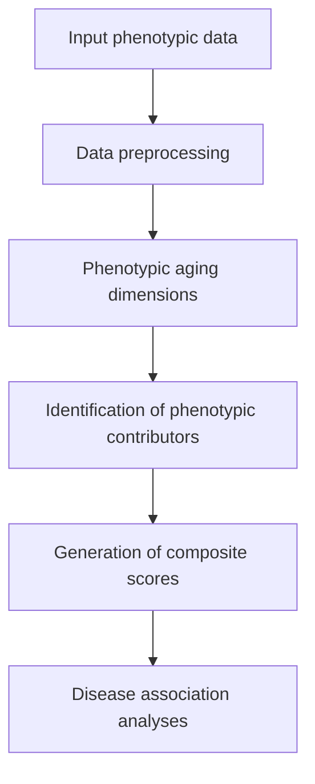

## PUMA: Phenotypic Unsupervised Model of Aging

PUMA is an unsupervised framework for identifying multidimensional phenotypic aging dimensions from large-scale population cohorts and evaluating their associations with future health outcomes.
The framework was developed using the Dutch Lifelines cohort and is designed to characterize heterogeneity in aging by integrating behavioral, psychological, social, physical, environmental, and biomedical phenotypes.
This repository accompanies the manuscript *PUMA: Phenotypic Unsupervised Model of Aging Reveals Distinct Aging Dimensions*.

## Workflow



## Features
- Data preprocessing and quality control for large-scale phenotypic datasets.
- Construction of multidimensional phenotypic aging dimensions.
- Identification of phenotypic variables contributing to each aging dimension.
- Generation of individual composite scores.
- Association analyses between phenotypic dimensions and incident age-related diseases.

## Structure
PUMA-phenotypic-aging/
├── pipeline/    # R scripts implementing the complete PUMA workflow, from data preprocessing to disease association analyses.
└── README.md

## Installation
Clone this repository:
```bash
git clone https://github.com/GhorbaniF/PUMA-phenotypic-aging.git
cd PUMA-phenotypic-aging
```
Install the required R packages before running the pipeline.

## Usage
The `pipeline/` directory contains the R implementation of the complete PUMA workflow. The pipeline was developed and tested using **R 4.2.1**.
Before running the pipeline:
- Update the input and output file paths as needed.
- If running on an HPC cluster, load the appropriate R module (if required).

Run the pipeline with:
```bash
Rscript puma_pipeline.R
```
## Data availibilty
The Lifelines cohort data used in this study are not publicly available due to participant privacy and data-sharing restrictions.
Researchers interested in accessing the data should apply directly through the Lifelines study (https://www.lifelines.nl).

## Citation
If you use PUMA in your research, please cite:
Ghorbani F, et al. PUMA: Phenotypic Unsupervised Model of Aging Reveals Distinct Aging Dimensions.
bioRxiv, 2026.

## Project status
This repository accompanies the PUMA bioRxiv preprint. Updates may be made as the manuscript progresses through peer review.

## License
This project is licensed under the MIT License. See the `LICENSE` file for details.
