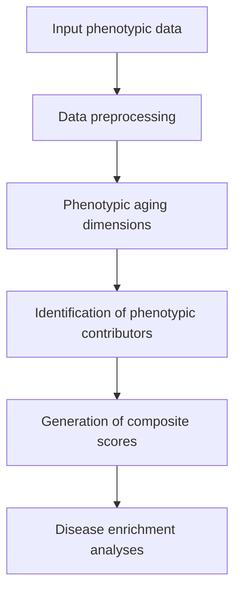

# PUMA: Phenotypic Unsupervised Model of Aging

PUMA is an unsupervised framework for identifying multidimensional phenotypic aging dimensions from large-scale population cohorts and evaluating their associations with future health outcomes.

The framework was developed using more than 1,000 phenotypic traits from over 150,000 participants in the Dutch Lifelines cohort and is designed to characterize heterogeneity in aging by integrating behavioral, psychological, social, physical, environmental, and biomedical phenotypes.

This repository accompanies the manuscript *PUMA: Phenotypic Unsupervised Model of Aging Reveals Distinct Aging Dimensions*.

## Workflow


```mermaid
flowchart TD
    A[Input phenotypic data]
    --> B[Data preprocessing]
    --> C[Phenotypic aging dimensions]
    --> D[Identification of phenotypic contributors]
    --> E[Generation of composite scores]
    --> F[Disease enrichment analyses]
```

## Features

- Data preprocessing and quality control for large-scale phenotypic datasets.
- Construction of multidimensional phenotypic aging dimensions.
- Identification of phenotypic variables contributing to each aging dimension.
- Generation and age standardization of individual composite scores.
- Enrichment analyses of incident age-related diseases across PUMA composite-score distributions.

## Repository structure

The analysis is organized according to the main steps of the PUMA workflow:

```text
PUMA-phenotypic-aging/
├── 01_preprocessing/             # Data cleaning and quality control
├── 02_dimensionality_reduction/  # PCA and identification of aging dimensions
├── 03_partial_correlation/       # Phenotypic characterization of dimensions
├── 04_composite_scores/          # Composite-score calculation and age standardization
├── 05_disease_enrichment/        # Prospective disease enrichment analyses
├── README.md
└── LICENSE
```

## Installation

Clone this repository:

```bash
git clone https://github.com/GhorbaniF/PUMA-phenotypic-aging.git
cd PUMA-phenotypic-aging
```

Install the required R packages before running the analysis.

## Required R packages

The analysis requires the following core R packages:

- `dplyr`
- `fgsea`
- `ggplot2`
- `ppcor`
- `tidyr`

The pipeline was developed and tested using **R 4.2.1**.

## Usage

The PUMA workflow is implemented in five sequential analysis steps corresponding to the numbered directories above.

Before running the analysis:

- Update the input and output file paths as needed.
- If running on an HPC cluster, load the appropriate R module if required.

## Running the analysis

Run the analysis scripts sequentially from the repository root:

```bash
Rscript 01_preprocessing/01_preprocessing.R
Rscript 02_dimensionality_reduction/02_dimensionality_reduction.R
Rscript 03_partial_correlation/03_partial_correlation.R
Rscript 04_composite_scores/04_composite_scores.R
Rscript 05_disease_enrichment/05_disease_enrichment.R
```

## Data availability

The Lifelines cohort data used in this study are not publicly available due to participant privacy and data-sharing restrictions. Researchers interested in accessing the data should apply directly through the Lifelines study.

## Citation

If you use PUMA in your research, please cite:

Ghorbani F, et al. *PUMA: Phenotypic Unsupervised Model of Aging Reveals Distinct Aging Dimensions*. bioRxiv, 2026. DOI: 10.64898/2026.07.22.740035.

## Project status

This repository accompanies the PUMA bioRxiv preprint. Updates may be made as the manuscript progresses through peer review.

## License

This project is licensed under the MIT License. See the `LICENSE` file for details.
